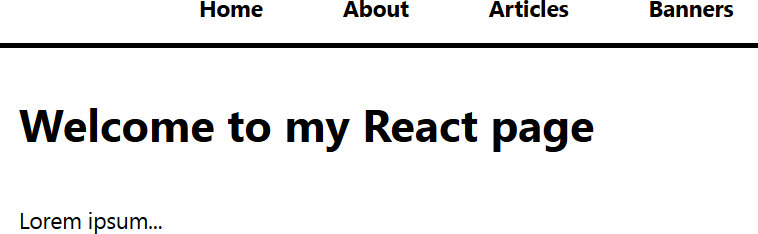
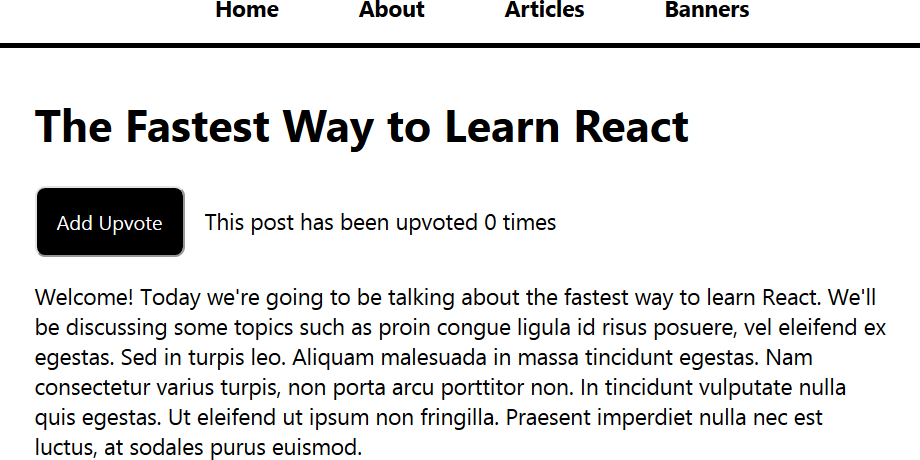
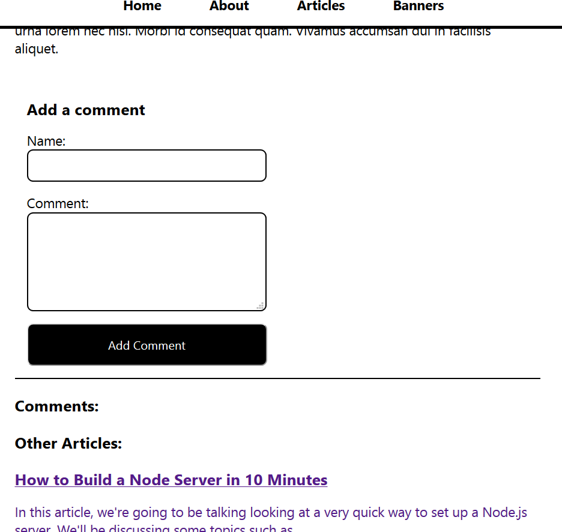
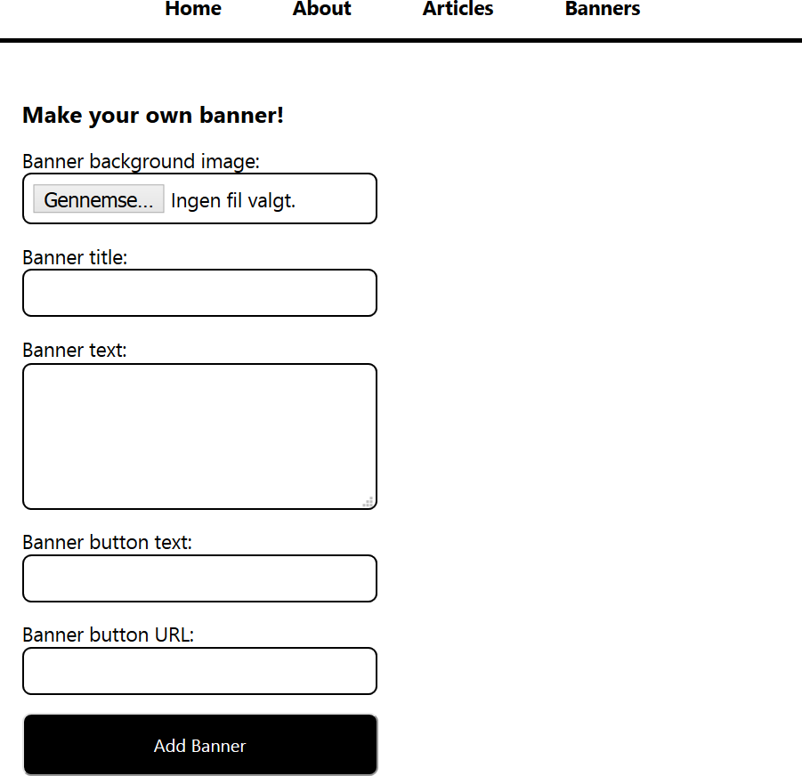
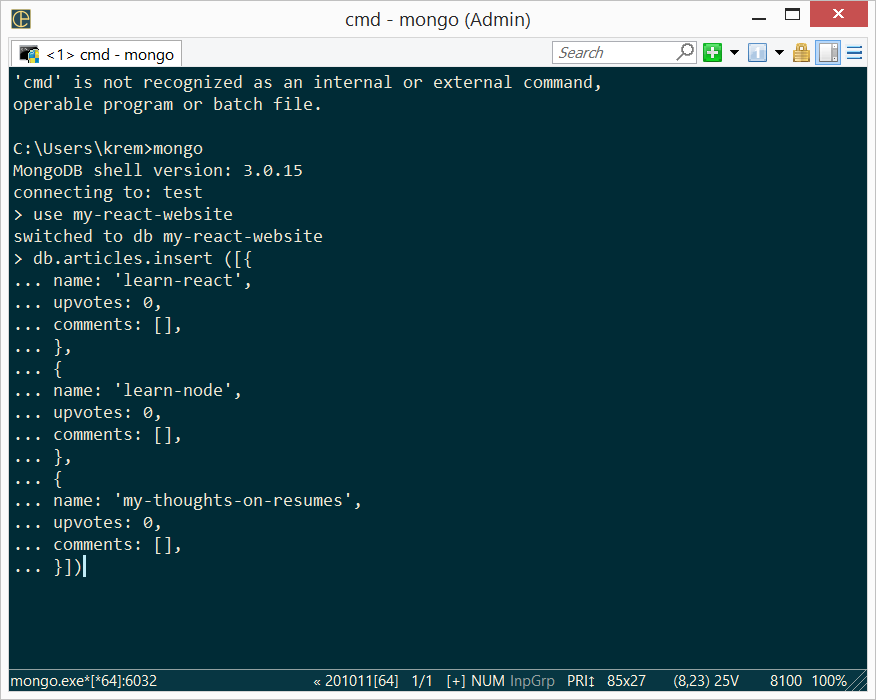

# React_website
My first project in React. A small blog webpage.
 It is a MERN website, so you will need MongoDB for database.

You can read articles and upvote them:

Add comments to article:

Add banners:

# File structure
<ul>
    <li>Frontend folder: my-react-website</li>
    <li>Backend folder: my-react-website-backend</li>
</ul>

# Run frontend
<ul>
    <li>Download or clone the project to your local machine</li>
    <li>Change to the folder my-react-website</li>
    <li>To add node_modules run: <code>npm install</code></li>
    <li>Install any other dependancies: react-scripts, react-router-dom, axios, ...</li>
    <li>To run the frontend use: <code>npm start</code></li>
</ul>

# Run backend
<ul>
    <li>Change to the folder my-react-website-backend</li>
    <li>To add node_modules run: <code>npm install</code></li>
    <li>To build and start the server run: <code>npm start</code></li>
</ul>

# Run MongoDB
<ul>
    <li>Download and install MongoDB</li>
    <li>Run the MongoDB client: <code>mongo</code></li>
    <li>Add an empty array to be able to add votes and comments in articles</li>
    
    <li>Run MongoDB in a separate terminal: <code>mongod</code></li>
</ul>

# View the website
You need to run the frontend, backend and MongoDB at the same time/in different terminals. 
 You can view the app at http://localhost:3000
